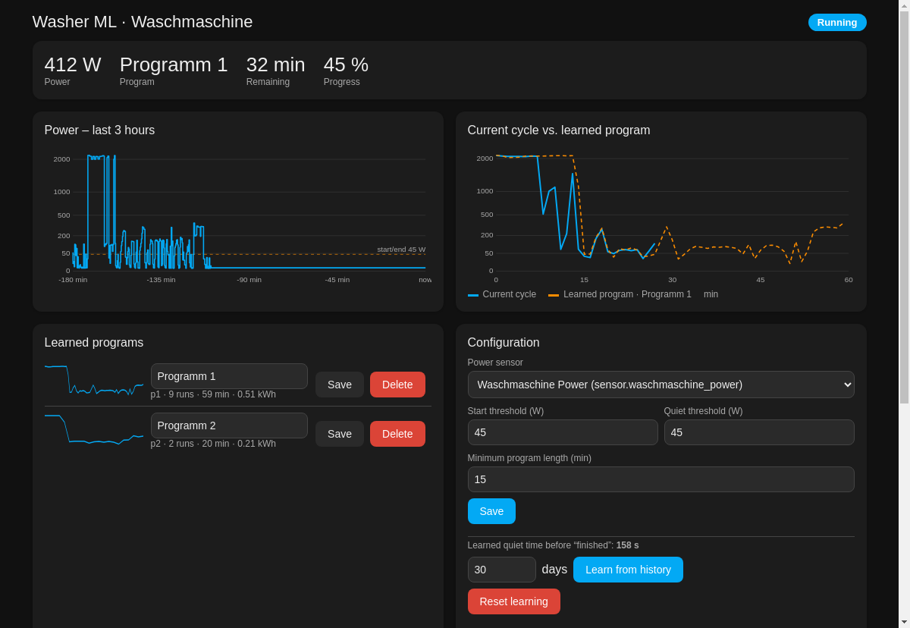

# Appliance ML – learning cycle detection for washing machines, dishwashers, dryers & more

Detects when a household appliance **really** finished by learning its power curve, recognises the
running program, predicts the remaining time and ships its own dashboard panel with graphs and
configuration. Works with any power-measuring smart plug; add one entry per appliance. Pure Python, no cloud, no extra dependencies.


*(example data)*

## Why
Many machines keep sending small power pulses (here: 25–35 W every ~5 min, for up to 18 min)
after the last spin. A fixed "idle for N minutes" rule is restarted by every pulse and reports
the end 5–20 min late. Appliance ML measures how long the machine is quiet *inside* a program and
ends the cycle after a learned quiet time (default 3 min, then 1.5 × the longest in-program pause).
On 12 real programs the alert came 2.7–4.5 min after the last spin (median ~3 min).

## Supported appliances
| Type | Start / quiet threshold | Quiet time before "finished" | Status |
|---|---|---|---|
| Washing machine | 45 W / 45 W | learned, 2–10 min (starts at 3) | **validated** on 12 recorded programs |
| Dishwasher | 15 W / 10 W | learned, 5–30 min (starts at 10) | preset + synthetic tests, needs real data |
| Tumble dryer | 30 W / 20 W | learned, 4–20 min (starts at 7) | preset + synthetic tests, needs real data |
| Oven / other | 60 W / 40 W · 20 W / 10 W | learned | generic starting point |

The presets are only starting points: every device learns its own quiet time and its own programs.
Thresholds can be changed per device in the panel. Dishwasher/dryer presets are unvalidated – please
open an issue with a power curve if yours misbehaves.

## Features
* **Finish detection** from the power curve, self-adjusting.
* **Program recognition**: finished cycles are clustered with dynamic time warping (DTW) on the
  per-minute power curve; the running cycle is matched with an open-ended DTW → program,
  remaining time, progress. A recognised program with lots of runtime left needs a longer quiet time.
* **Learns from history**: on first setup it replays the recorder history (30 days by default).
* **Dashboard panel** (sidebar "Appliance ML"): live power graph, current cycle vs. learned program,
  learned programs (rename / delete), run list, and configuration (power sensor, thresholds,
  *Learn from history*, *Reset*).
* Entities: `binary_sensor … running`, `sensor … status / program / remaining / progress / last duration / last energy / learned quiet time`.
* Events: `appliance_ml_cycle_started`, `appliance_ml_cycle_finished` (`appliance`, `entry`, `program`, `duration_min`, `energy_kwh`, `new_program`).

## Install
**HACS:** HACS → ⋮ → Custom repositories → add `https://github.com/fisch192/ha-appliance-ml` (category *Integration*) → install → restart.
**Manual:** copy `custom_components/appliance_ml` to `<config>/custom_components/`, restart.

Then *Settings → Devices & services → Add integration → Appliance ML*, choose the appliance type and
your power sensor (W). Repeat for each appliance. Requires the recorder (default) for learning from history.

## YAML setup (optional)
```yaml
appliance_ml:
  - name: Washing machine
    appliance_type: washing_machine   # washing_machine | dishwasher | dryer | oven | other
    power_entity: sensor.washer_power
```
The entry is created once on startup and can afterwards be changed in the panel.

## Appliances without their own power sensor (estimated mode)
If a machine has no metering plug, use `activity_entity` (an entity whose state says it is running,
e.g. a Home Connect operation state) plus `total_power_entity` (house/circuit power). The integration
learns the appliance's share from the change in total power while it runs. Optional `program_entity`
reports the program name.
```yaml
appliance_ml:
  - name: Dishwasher
    appliance_type: dishwasher
    activity_entity: sensor.dishwasher_operation_state
    active_states: run,running
    total_power_entity: sensor.house_power
```

## Monitor types (fridge, baseload)
`fridge` and `baseload` do not detect programs; they watch energy use, compressor duty and standby
power and fire `appliance_ml_problem` / `appliance_ml_problem_cleared` events when something drifts
(e.g. compressor running continuously, no power readings).

## Notification example
See `packages/appliance_ml_notify.yaml` (event-triggered automation).

## Services
`appliance_ml.learn_from_history`, `appliance_ml.rename_program`, `appliance_ml.delete_program`, `appliance_ml.reset_learning`.

## Tuning
Start/quiet thresholds default to 45 W (above the machine's standby pulses, below real work);
change them in the panel. If your machine has long soak pauses with very low power, the
learned quiet time adapts after a few cycles.

## Development
`python3 tests/test_engine.py` replays 12 recorded washing-machine programs (`tests/recorded_cycles.json`); `python3 tests/test_appliances.py` uses synthetic dishwasher/dryer curves; `tests/test_estimator.py` and `tests/test_monitor.py` cover estimated mode and the monitors.
`python3 tests/replay.py` prints, per program, the delay between last spin and alert.
The Home Assistant glue (config flow, entities, panel) was developed against HA 2026.x; the
engine is covered by tests, the integration layer was checked syntactically and the panel was
rendered in a headless browser with mock data.

License: MIT
